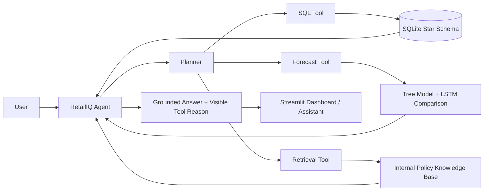

```mermaid
flowchart LR
U[User] --> A[RetailIQ Agent]
A --> P[Planner]
P --> S[SQL Tool]
P --> F[Forecast Tool]
P --> R[Retrieval Tool]
S --> DB[(SQLite Star Schema)]
F --> M[Tree Model + LSTM Comparison]
R --> KB[Internal Policy Knowledge Base]
DB --> A
M --> A
KB --> A
A --> O[Grounded Answer + Visible Tool Reason]
O --> UI[Streamlit Dashboard / Assistant]
```